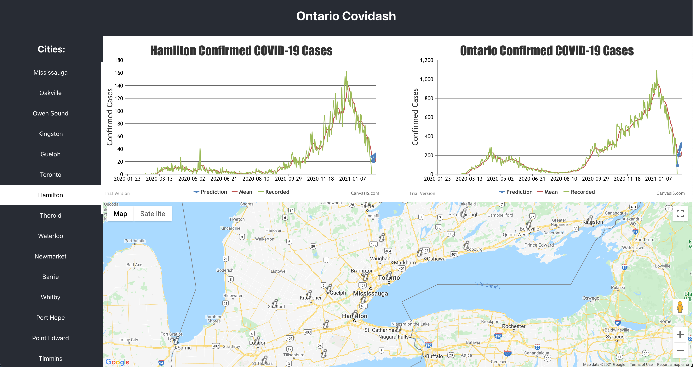

# CoviDash-stacked

## Inspiration

COVID is a very contagious virus and it would every good to be able to predict what the case count will look like in the next few days so that institutions like hospitals or retirement homes may preemptively prepare supplies/staff/etc...

## What it does

Predicts up to 7 days in the future the case count of COVID-19 using LSTM and Transformer with Attention.

## How we built it

The project was built using PyTorch and Tensorflow for each of the LSTM and Transformer, respectively. Jupiter notebooks were used to improve the ease of understanding. This project is accompanied by a react web app that can be accessed here: http://covidash.s3-website.ca-central-1.amazonaws.com/

## Challenges we ran into

Creating the transformer for time-series prediction was difficult, as the transformer model was not originally designed to do time-series prediction. Instead it was designed for NLP purposes where inputs can be converted to 'tokens' easily read by the algorithm.

The stacking of the algorithms wasn't completed due to the time constraints of the hackathon, but we will be implementing it in the future!

## Accomplishments that we're proud of

We are proud of the web app that was created and how well the data appeared when viewed with it.

## What we learned

We learned more about transformers and time-series prediction models, what makes a data model good, and what is the best way to store the model.

## What's next for CoviDash-stacked

Add more models to the stack.

## Built With

pytorch
react
tensorflow

# Try it out

http://covidash.s3-website.ca-central-1.amazonaws.com/
